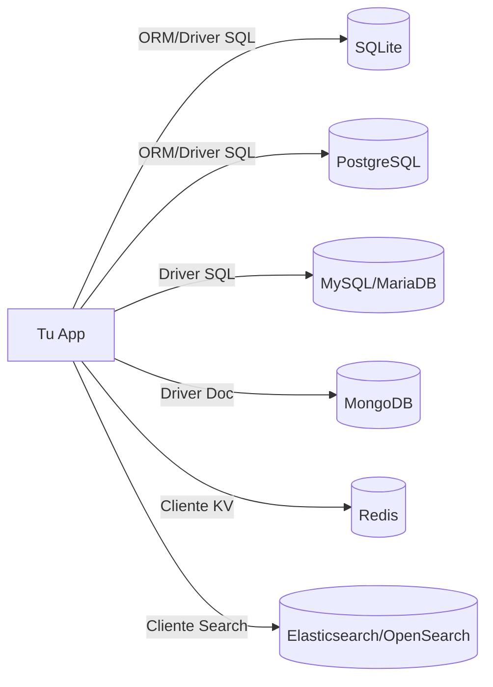
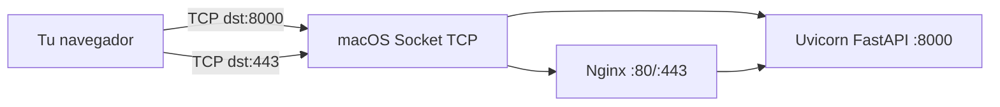
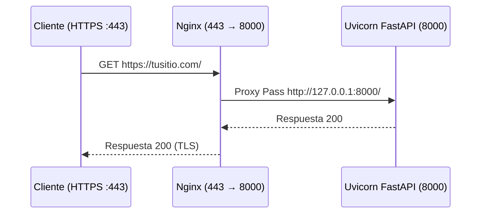
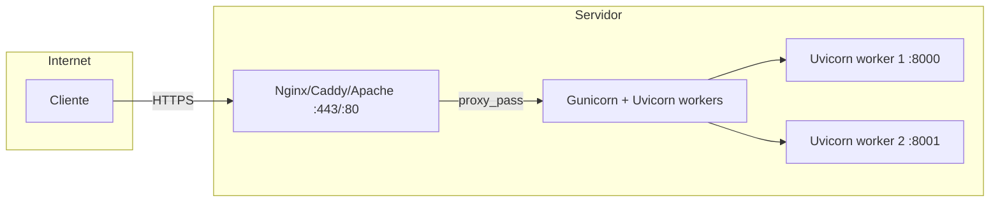

# Museo de Ideas — App Full‑Stack con FastAPI + SQLite

Aprende, paso a paso, cómo se arma una app web real con frontend, backend y base de datos. Este repo incluye:
- Una página creativa (SPA simple) para publicar ideas, listarlas y dar “me gusta”.
- Un backend en FastAPI que expone una API REST y sirve los archivos estáticos.
- Una base de datos SQLite (local, sin dependencias externas) con un modelo de ejemplo.
- Guías de instalación y uso en Ubuntu, macOS, Windows y Raspberry Pi.
- Comandos de desarrollo listos con `make` (y alternativas si no tienes `make`).

La meta es que entiendas cómo se conectan las piezas: navegador → API → DB, que puedas leer y modificar el código, y que tengas un camino claro para llevarlo a producción con buenas prácticas.


## Demo Local (qué vas a ver)
- Página con un formulario para crear ideas (título, descripción y tags).
- Lista de ideas en tiempo real (se recarga desde la API).
- Botón de “Like” por idea.
- Todo persistido en `SQLite` dentro de `data/app.db`.


## Arquitectura (visión general)
- Frontend: HTML + CSS + JS vanilla. Usa `fetch()` para hablar con la API.
- Backend: `FastAPI` (Python) + `Uvicorn` como ASGI server.
- Base de datos: `SQLite` con `SQLAlchemy ORM`.
- Servido como una sola app: FastAPI monta los archivos estáticos del frontend.

Flujo principal:
1) El navegador pide `/` → FastAPI entrega `frontend/index.html`.
2) JS en el navegador usa `fetch('/api/ideas')` para obtener ideas.
3) Al crear una idea, el navegador hace `POST /api/ideas` (JSON).
4) FastAPI valida datos, guarda en SQLite, y retorna la nueva idea.
5) Al dar like, `POST /api/ideas/{id}/like` incrementa el contador.


## Herramientas utilizadas (y por qué)
- FastAPI: framework moderno, tipado y muy rápido para APIs.
- Starlette StaticFiles: sirve archivos estáticos de forma eficiente.
- SQLAlchemy: ORM maduro para mapear clases Python a tablas SQL.
- SQLite: base de datos embebida, ideal para desarrollo local.
- Uvicorn: servidor ASGI de alto rendimiento.
- Python 3.11+: tipado, rendimiento y ecosistema sólido.
- Makefile: atajos de comandos repetibles y portables.

Conceptos reales detrás:
- ASGI/WSGI, CORS, ORM, migraciones, capas (controller/service/repo), HTTP verbs, status codes, JSON, índices, inmutabilidad en `POST` vs `PUT/PATCH`.


## Requisitos previos
- Python 3.11 o superior (`python3 --version`).
- Git instalado (`git --version`).
- make (opcional pero recomendado). En Windows puedes usar PowerShell sin make.

### Instalar herramientas base por sistema operativo
- Ubuntu/Debian/Raspberry Pi (Raspbian):
  - `sudo apt update`
  - `sudo apt install -y python3 python3-venv python3-pip git make sqlite3`
- macOS (Homebrew):
  - `brew install python git make sqlite`
- Windows (PowerShell + winget):
  - `winget install Python.Python.3.11`
  - `winget install Git.Git`
  - Opcional: `winget install GnuWin32.Make` (o usa los comandos manuales sin make)


## Clonación del repositorio con SSH (paso a paso)
1) Genera tu clave SSH (si no tienes una):
   - Ubuntu/macOS:
     - `ssh-keygen -t ed25519 -C "tu_email@ejemplo.com"`
     - Acepta ruta por defecto y pon una passphrase (recomendado).
     - Obtén la clave pública: `cat ~/.ssh/id_ed25519.pub`
   - Windows (PowerShell):
     - `ssh-keygen -t ed25519 -C "tu_email@ejemplo.com"`
     - Luego: `type $env:USERPROFILE\.ssh\id_ed25519.pub`
   - Raspberry Pi: igual que Ubuntu.
2) Copia el contenido de tu clave pública en GitHub > Settings > SSH and GPG keys > New SSH key.
3) Prueba la conexión: `ssh -T git@github.com` (acepta fingerprint si es la primera vez).
4) Clona este repo:
   - `git clone git@github.com:tagaa8/ejercicios_de_aprendizaje.git`
   - `cd ejercicios_de_aprendizaje`


## Instalación y ejecución
Con `make` (recomendado):
- `make install` → crea venv e instala dependencias.
- `make run` → levanta el servidor en `http://127.0.0.1:8000`.
- `make seed` → carga datos de ejemplo en la base.

Sin `make` (comandos equivalentes):
- Linux/macOS/Raspberry Pi:
  - `python3 -m venv .venv`
  - `source .venv/bin/activate`
  - `pip install -U pip`
  - `pip install -r backend/requirements.txt`
  - `python3 -m scripts.seed`
  - `uvicorn backend.app:app --reload --port 8000`
- Windows (PowerShell):
  - `python -m venv .venv`
  - `.venv\Scripts\Activate.ps1`
  - `python -m pip install -U pip`
  - `pip install -r backend\requirements.txt`
  - `python -m scripts.seed`
  - `uvicorn backend.app:app --reload --port 8000`

Abre tu navegador en `http://127.0.0.1:8000`.


## Cómo está organizado el código
- `frontend/` → `index.html`, `styles.css`, `app.js` (UI + fetch API).
- `backend/`
  - `app.py` → define FastAPI, rutas `/api/*`, CORS, estáticos.
  - `db.py` → engine SQLite, sesión y Base de SQLAlchemy.
  - `models.py` → modelo ORM `Idea`.
  - `requirements.txt` → dependencias Python.
- `scripts/`
  - `seed.py` → inserta ideas de ejemplo en SQLite.
- `data/` → se crea al correr la app; contiene `app.db`.
- `Makefile`, `.env.example`, `.gitignore`, `README.md`.


## API (endpoints principales)
- `GET /api/health` → verificación rápida del backend.
- `GET /api/ideas` → lista todas las ideas.
- `POST /api/ideas` → crea una idea. Body JSON:
  ```json
  { "title": "...", "description": "...", "tags": ["creatividad","ux"] }
  ```
- `POST /api/ideas/{id}/like` → incrementa likes.
- `DELETE /api/ideas/{id}` → elimina una idea (demo de operación destructiva).

Códigos HTTP usados: `200`, `201`, `204`, `400`, `404`, `422`.


## Base de datos (SQLite)
- Archivo: `data/app.db`.
- Modelo `Idea` con columnas: `id`, `title`, `description`, `tags_json` (JSON en texto), `likes`, `created_at`.
- Inspección rápida:
  - `sqlite3 data/app.db ".tables"`
  - `sqlite3 data/app.db "PRAGMA table_info(ideas);"`
  - `sqlite3 data/app.db "SELECT id, title, likes FROM ideas;"`

¿Por qué SQLite? Es cero-config, ideal para desarrollo y demos. Para producción multiusuario, es común migrar a Postgres/MySQL.


## SQLite: mini masterclass (CLI útil)
Nota: `SHOW TABLES` es de MySQL; en SQLite usa `.tables`, `.schema` y `PRAGMA`.

- Ver tablas y esquemas:
  - `sqlite3 data/app.db ".tables"`
  - `sqlite3 data/app.db ".schema ideas"` (DDL de la tabla)
  - `sqlite3 data/app.db "PRAGMA database_list;"` (bases adjuntas)
- Inspeccionar columnas, claves y índices:
  - `sqlite3 data/app.db "PRAGMA table_info(ideas);"`
  - `sqlite3 data/app.db "PRAGMA foreign_key_list(ideas);"`
  - `sqlite3 data/app.db "PRAGMA index_list(ideas);"`
  - Para un índice específico: `sqlite3 data/app.db "PRAGMA index_info(nombre_indice);"`
- Consultas frecuentes:
  - Top ideas por likes: `sqlite3 data/app.db "SELECT id,title,likes FROM ideas ORDER BY likes DESC LIMIT 5;"`
  - Búsqueda por título: `sqlite3 data/app.db "SELECT id,title FROM ideas WHERE title LIKE '%radio%';"`
  - Conteo total: `sqlite3 data/app.db "SELECT COUNT(*) FROM ideas;"`
  - Paginación: `sqlite3 data/app.db "SELECT id,title FROM ideas ORDER BY id DESC LIMIT 10 OFFSET 0;"`
- Trabajar con JSON (extensión json1 suele venir activada):
  - Listar todos los tags: `sqlite3 data/app.db "SELECT DISTINCT value AS tag FROM ideas, json_each(ideas.tags_json) ORDER BY tag;"`
  - Conteo por tag: `sqlite3 data/app.db "SELECT value AS tag, COUNT(*) AS n FROM ideas, json_each(ideas.tags_json) GROUP BY tag ORDER BY n DESC;"`
  - Largo del array de tags: `sqlite3 data/app.db "SELECT id, json_array_length(tags_json) AS n_tags FROM ideas;"`
- Rendimiento y plan de ejecución:
  - `sqlite3 data/app.db "EXPLAIN QUERY PLAN SELECT * FROM ideas WHERE title LIKE '%ai%';"`
  - Crear índice (ejemplo): `sqlite3 data/app.db "CREATE INDEX IF NOT EXISTS idx_ideas_title ON ideas(title);"`
- Transacciones seguras:
  - `sqlite3 data/app.db "BEGIN; UPDATE ideas SET likes = likes + 1 WHERE id = 1; COMMIT;"`
  - Deshacer: usa `ROLLBACK;` en lugar de `COMMIT;` si algo falla.
- Exportar/Importar datos:
  - CSV con encabezados: `sqlite3 -header -csv data/app.db "SELECT * FROM ideas;" > ideas.csv`
  - Importar CSV a una tabla existente con mismas columnas:
    - `sqlite3 data/app.db ".mode csv" ".import ideas.csv ideas"`
- Backups y mantenimiento:
  - Backup atómico: `sqlite3 data/app.db ".backup 'backup-$(date +%Y%m%d).db'"`
  - Reclamación de espacio: `sqlite3 data/app.db "VACUUM;"`
  - Optimización sugerida: `sqlite3 data/app.db "PRAGMA optimize;"`
- Consejos de migración en SQLite:
  - `ALTER TABLE ... ADD COLUMN` funciona, pero renombrar/eliminar columnas suele requerir crear una tabla nueva, copiar datos y renombrar.
  - Para cambios no triviales, usa una herramienta de migraciones (p.ej. Alembic) o script controlado.

### Encabezados y formato de salida (como en MySQL)
- One‑liner con encabezados y columnas alineadas:
  - `sqlite3 -header -column data/app.db "SELECT * FROM ideas;"`
- One‑liner en CSV con encabezados (útil para Excel/Sheets):
  - `sqlite3 -header -csv data/app.db "SELECT * FROM ideas;" > ideas.csv`
- Modo interactivo (dentro de sqlite3):
  - `sqlite3 data/app.db`
  - `.headers on` (muestra títulos de columna)
  - `.mode column` (columnas alineadas)
  - Opciones modernas si tu sqlite3 es reciente (>= 3.41):
    - `.mode table` (tabla ASCII)
    - `.mode box` (bordes tipo box)
    - `.mode markdown` (tabla Markdown)
- Hacerlo permanente en tu shell creando `~/.sqliterc`:
  - Contenido sugerido:
    - `.headers on`
    - `.mode column`
- macOS con Homebrew (sqlite más nuevo):
  - `brew install sqlite`
  - Ejecuta el binario de Homebrew:
    - `$(brew --prefix)/opt/sqlite/bin/sqlite3 -header -cmd ".mode table" data/app.db "SELECT * FROM ideas;"`
- Renombrar encabezados con alias:
  - `sqlite3 -header -column data/app.db "SELECT id AS ID, title AS Título, likes AS Likes FROM ideas;"`


## Cómo funciona todo (de punta a punta)
- El navegador carga `index.html` y `app.js`.
- `app.js` hace `fetch('/api/ideas')` para renderizar la lista.
- Al enviar el formulario, `app.js` hace `POST /api/ideas` con JSON válido.
- FastAPI valida con Pydantic, transforma `tags` en JSON y usa SQLAlchemy para insertar.
- La transacción se confirma; la API responde con el recurso creado.
- Al hacer click en like, `app.js` invoca `POST /api/ideas/{id}/like` y re-renderiza.

Conceptos clave:
- Separación de responsabilidades: UI vs. API vs. DB.
- ORM reduce SQL repetitivo, pero comprender SQL sigue siendo importante.
- Validación de entrada y manejo de errores (422, 400, 404).
- Idempotencia: `POST /like` no es idempotente (sube el contador cada vez).


## Llevar a producción (camino sugerido)
- Opción simple (1 VM):
  - Crear venv, instalar deps y ejecutar `uvicorn backend.app:app --host 0.0.0.0 --port 8000` como servicio systemd.
  - Poner NGINX como reverse proxy (TLS con Let’s Encrypt) hacia `127.0.0.1:8000`.
  - Backup del archivo `data/app.db` con cron.
- Opción avanzada:
  - Migrar a Postgres (cambiar cadena de conexión y modelos, añadir Alembic para migraciones).
  - Contenerizar con Docker y orquestar con Docker Compose.
  - Observabilidad: logs estructurados y métricas.

Ejemplo de servicio systemd (resumen):
```
[Unit]
Description=Museo de Ideas
After=network.target

[Service]
WorkingDirectory=/ruta/a/tu/repo
Environment="PYTHONUNBUFFERED=1"
ExecStart=/ruta/a/tu/repo/.venv/bin/uvicorn backend.app:app --host 0.0.0.0 --port 8000
Restart=always
User=www-data
Group=www-data

[Install]
WantedBy=multi-user.target
```


## Git: hacer push por SSH a este repo
1) Asegúrate de tener el remoto (debería venir al clonar por SSH):
   - `git remote -v`
   - Si no existe, añade: `git remote add origin git@github.com:tagaa8/ejercicios_de_aprendizaje.git`
2) Añade y commitea cambios:
   - `git add .`
   - `git commit -m "feat: app full-stack FastAPI + SQLite"`
3) Push:
   - `git push origin main`  (o `master`, según tu rama por defecto)

Nota: Si es tu primer push, puede que necesites `git push -u origin main`.


## Troubleshooting (problemas comunes)
- Puerto ocupado en 8000: cambia `--port 8001`.
- Error de permisos al crear `data/app.db`: verifica que el proceso pueda escribir en `data/`.
- CORS en otros orígenes: ajusta la configuración CORS en `backend/app.py`.
- Windows sin `make`: usa los comandos manuales indicados.
- No ves los estáticos: confirma que `uvicorn backend.app:app` inicia sin errores y abre `http://127.0.0.1:8000/`.


## Licencia y uso
Este proyecto es educativo. Úsalo para aprender, modificar y experimentar. No incluye datos sensibles.


## Masterclass de Bases de Datos (SQL vs NoSQL)
Aprende cuándo usar cada tipo de base y por qué. Incluye ejemplos reales y comandos para macOS (Mac M2).

### Mapa visual


### Conceptos clave
- SQL: esquema definido, relaciones, JOINs, transacciones ACID, consistencia fuerte.
- NoSQL: esquema flexible, escala horizontal más sencilla en ciertos casos, modelos: documentos, clave‑valor, columnas, grafos.
- Índices: aceleran lectura, ralentizan escritura. Elige columnas consultadas con frecuencia.
- Transacciones: agrupan cambios; en SQL son nativas; en NoSQL depende.
- CAP a grandes rasgos: Consistency, Availability, Partition tolerance; no puedes maximizar las tres a la vez.

### ¿Cuándo usar cada una?
- SQLite (SQL, embebida):
  - Casos: apps de escritorio/móviles, prototipos, demos, datalakes pequeños, CI.
  - Pros: cero configuración, un solo archivo, rápida en lecturas locales.
  - Contras: escritura concurrente limitada (lock a nivel de DB), sin servidor multiusuario.
  - En este proyecto: perfecta para local/educativo. Archivo: `data/app.db`.
- PostgreSQL (SQL, servidor):
  - Casos: backend transaccional serio, JSONB mixto, funciones avanzadas, extensiones (PostGIS, Timescale).
  - Pros: ACID sólido, tipos ricos, ventanas, CTE, `JSONB`, `GIN`/`BRIN`, buena concurrencia.
  - Contras: más mantenimiento; requiere servidor.
  - Ejemplo JSONB: `SELECT * FROM ideas WHERE tags @> '["ux"]'::jsonb;`
- MySQL/MariaDB (SQL, servidor):
  - Casos: SaaS, e‑commerce, blogs, stacks LAMP/LNMP.
  - Pros: soporte masivo, replicación madura, muy rápida en lecturas.
  - Contras: algunas diferencias SQL (p.ej. CTE y funciones ventana históricamente más limitadas según versión).
- MongoDB (NoSQL documentos):
  - Casos: esquemas fluidos, documentos anidados (catálogos, eventos), prototipos rápidos.
  - Pros: flexibilidad, sharding integrado, índices variados.
  - Contras: transacciones multi‑documento tardías; modelar relaciones complejas puede ser más difícil.
  - Ejemplo: `db.ideas.find({ tags: "ux" })`
- Redis (NoSQL clave‑valor in‑memory):
  - Casos: caché, colas, sesiones, rate‑limit.
  - Pros: latencias en micro/milis, estructuras de datos (listas, sets, sorted sets).
  - Contras: memoria cara; persistencia y tamaños requieren cuidado.
  - Ejemplo: `SET idea:1:likes 10` y `INCR idea:1:likes`.
- Elasticsearch/OpenSearch (NoSQL búsqueda):
  - Casos: full‑text search, logs, analytics.
  - Pros: relevancia, agregaciones, escalado horizontal.
  - Contras: consumo RAM/CPU; consistencia eventual.

### Comandos útiles (macOS, Homebrew)
Nota: estos sirven para aprender; este proyecto usa SQLite por defecto.
- Instalar servidores (si quieres practicar):
  - Postgres: `brew install postgresql@16 && brew services start postgresql@16`
  - MySQL: `brew install mysql && brew services start mysql`
- Conectarte rápido:
  - Postgres: `psql postgres` (o `psql -h 127.0.0.1 -U tu_usuario -d tu_db`)
  - MySQL: `mysql -u root -p`
- Crear DB/tablas (ejemplos SQL similares entre motores):
  ```sql
  CREATE TABLE ideas (
    id SERIAL PRIMARY KEY,
    title VARCHAR(200) NOT NULL,
    description TEXT NOT NULL,
    likes INT NOT NULL DEFAULT 0
  );
  CREATE INDEX idx_ideas_title ON ideas(title);
  ```
- JSON en Postgres (equivalente conceptual a `tags_json` de este proyecto):
  ```sql
  ALTER TABLE ideas ADD COLUMN tags JSONB NOT NULL DEFAULT '[]';
  SELECT id, title FROM ideas WHERE tags @> '["ux"]'::jsonb;
  ```

### Buenas prácticas universales
- Define claves primarias y restricciones (NOT NULL, UNIQUE, FK).
- Índices sólo donde aportan; mide con `EXPLAIN`/`EXPLAIN ANALYZE`.
- Migraciones versionadas (Alembic con SQLAlchemy, Flyway, Liquibase).
- Backups y restauración probados; no basta con hacerlos, hay que ensayar.
- Observa métricas: conexiones, locks, latencias, I/O, tamaño de índices.

### Ejercicios con este proyecto (SQLite)
- Top tags (usa extensión json1):
  `sqlite3 data/app.db "SELECT value tag, COUNT(*) n FROM ideas, json_each(tags_json) GROUP BY tag ORDER BY n DESC;"`
- Índice por título y medición:
  1) `sqlite3 data/app.db "EXPLAIN QUERY PLAN SELECT * FROM ideas WHERE title LIKE '%AI%';"`
  2) `sqlite3 data/app.db "CREATE INDEX IF NOT EXISTS idx_ideas_title ON ideas(title);"`
  3) Repite el `EXPLAIN QUERY PLAN` y compara.


## Servidores y Puertos (cómo se habla la red)
Entiende qué es un puerto, por qué existe y cómo verlo en tu Mac.

### Idea general


- IP identifica un host; el puerto identifica un proceso/servicio en ese host.
- Puertos bien conocidos: 22 (SSH), 80 (HTTP), 443 (HTTPS); app suele usar 8000/3000 en dev.
- `127.0.0.1` (localhost) es tu máquina; `0.0.0.0` significa “todas las interfaces”.
- Un proceso “escucha” en un puerto (LISTEN). El cliente usa un puerto efímero para conectarse.

### Ejemplo real con este proyecto
- Ejecuta el server: `make run` (levanta en `http://127.0.0.1:8000`).
- Comprueba salud:
  - `curl -I http://127.0.0.1:8000/api/health`
- Ver procesos escuchando puertos (macOS):
  - `lsof -iTCP -sTCP:LISTEN -n -P | grep -E ':8000|:80|:443'`
- Ver quién usa el 8000 específicamente:
  - `lsof -i :8000 -n -P`
- Probar conectividad TCP:
  - `nc -vz 127.0.0.1 8000`

### Cambiar puertos y resolver conflictos
- Si `8000` está ocupado: `uvicorn backend.app:app --reload --port 8001`
- En este repo con `make`: `make run PORT=8001` (puedes exportar `PORT` y leerlo en app si lo implementas).
- Matar proceso (con cuidado):
  - `kill -15 <PID>` y si no responde `kill -9 <PID>`

### Servir hacia Internet (reverse proxy)


- Nginx escucha en 443 con TLS y reenvía al backend en 127.0.0.1:8000.
- Beneficios: TLS, compresión, límites, logging centralizado, múltiples apps en un host.

### Puertos y firewall en macOS (tips)
- Abrir/permitir apps: Preferencias del Sistema > Seguridad y Privacidad > Firewall > Opciones.
- Comprobar escucha local no requiere cambios de firewall.

### Red local (LAN) y `0.0.0.0`
- Para que otros dispositivos de tu red accedan al server en tu Mac:
  - Levanta en todas las interfaces: `uvicorn backend.app:app --host 0.0.0.0 --port 8000`
  - Descubre tu IP en Wi‑Fi: `ipconfig getifaddr en0`
  - Desde otro equipo: `http://TU_IP_LAN:8000`

### Glosario rápido
- Socket: extremo de comunicación (IP:puerto).
- Puerto efímero: puerto cliente temporal (macOS suele usar 49152–65535).
- Bind: acción de un proceso de escuchar en un puerto.
- Loopback: interfaz local (`127.0.0.1`).


## Servidores Web: Nginx, Apache, Caddy, etc.
Qué son, para qué sirven y cómo encajan con este proyecto.

### Rol de un servidor web
- Reverse proxy: recibe peticiones HTTP/HTTPS y las reenvía a tu app (Uvicorn) en un puerto interno.
- Terminación TLS: maneja certificados y HTTPS (puerto 443).
- Estáticos eficientes: sirve archivos estáticos con cache y compresión.
- Balanceo de carga: reparte tráfico entre varios procesos/hosts de tu app.
- Seguridad y límites: rate‑limit, tamaño máximo de request, headers de seguridad.

### ¿Qué usamos aquí y por qué?
- En desarrollo: Uvicorn (ASGI) ejecuta FastAPI y además sirve el frontend estático. Es suficiente y simple para local.
- En producción: se recomienda poner un servidor web delante (Nginx/Caddy/Apache) y detrás correr Uvicorn (o Gunicorn+Uvicorn workers) para:
  - Usar HTTPS/TLS fácil y seguro.
  - Mejor rendimiento en estáticos y control de cabeceras/caché.
  - Tolerancia a fallos y escalamiento (múltiples workers/backends).

### Patrones de despliegue típicos


### Opciones populares
- Nginx: muy usado, rápido, flexible. Ideal para reverse proxy y estáticos.
- Apache HTTPD: veterano, modular, ampliamente disponible. `mod_proxy` para reverse proxy.
- Caddy: configuración sencilla, TLS automático con Let’s Encrypt.
- Traefik: orientado a contenedores (Docker/K8s), configuración por etiquetas.

### Ejemplo Nginx → FastAPI (reverse proxy)
Archivo de sitio (Linux): `/etc/nginx/sites-available/museo` (en macOS Homebrew: `/opt/homebrew/etc/nginx/servers/museo.conf`):
```
server {
    listen 80;
    server_name _;

    # Archivos estáticos opcionales (si los sirves con Nginx):
    # location /assets/ {
    #     alias /ruta/al/repo/frontend/;
    #     expires 7d;
    # }

    location / {
        proxy_pass http://127.0.0.1:8000;
        proxy_set_header Host $host;
        proxy_set_header X-Real-IP $remote_addr;
        proxy_set_header X-Forwarded-For $proxy_add_x_forwarded_for;
        proxy_set_header X-Forwarded-Proto $scheme;
    }
}
```
Comandos útiles (macOS con Homebrew):
- `brew install nginx`
- Edita config: `/opt/homebrew/etc/nginx/nginx.conf` y crea archivos en `/opt/homebrew/etc/nginx/servers/`
- Verifica: `nginx -t -c /opt/homebrew/etc/nginx/nginx.conf`
- Arranca: `brew services start nginx` (detén con `brew services stop nginx`)

### Ejemplo Apache → FastAPI (reverse proxy)
Habilita módulos y usa `ProxyPass`/`ProxyPassReverse`:
```
<VirtualHost *:80>
  ServerName ejemplo.local
  ProxyPreserveHost On
  ProxyPass / http://127.0.0.1:8000/
  ProxyPassReverse / http://127.0.0.1:8000/
</VirtualHost>
```
Módulos requeridos: `proxy`, `proxy_http`. En macOS (Homebrew): `brew install httpd` y edición en `/opt/homebrew/etc/httpd/httpd.conf`.

### Ejemplo Caddy (TLS automático en dominio público)
Archivo `Caddyfile` minimal:
```
tu-dominio.com {
  reverse_proxy 127.0.0.1:8000
}
```
Caddy obtiene certificados de forma automática (requiere DNS público apuntando a tu servidor).

### Iniciar app server con múltiples workers
- Opción directa Uvicorn (varios procesos con `--workers`):
  - `uvicorn backend.app:app --host 0.0.0.0 --port 8000 --workers 2`
- Patrón clásico con Gunicorn + Uvicorn workers:
  - `pip install gunicorn uvicorn`
  - `gunicorn -k uvicorn.workers.UvicornWorker -w 2 -b 127.0.0.1:8000 backend.app:app`

### Probar extremo a extremo (local)
1) Inicia la app: `uvicorn backend.app:app --host 127.0.0.1 --port 8000`
2) Inicia Nginx (escucha en 80) y configura `proxy_pass` a `127.0.0.1:8000`.
3) Prueba:
   - `curl -I http://127.0.0.1/api/health` (deberías ver 200 vía Nginx)
   - `curl -I http://127.0.0.1:8000/api/health` (directo Uvicorn)

### ¿Servir estáticos con la app o con Nginx?
- Desarrollo: la app (FastAPI/StaticFiles) es suficiente.
- Producción: Nginx sirve estáticos con `expires`, `gzip/br`, y la app atiende sólo API.
